# Hướng dẫn điều khiển thiết bị Sunshine Smarthome bằng giọng nói thông qua Google Assistant    

## 1. Đặt tên thiết bị trong Sunshine Smarthome App

Hiện tại, việc điều khiển các thiết bị Smarthome chưa hỗ trợ Tiếng Việt chỉ có thể điều khiển bằng các ngôn ngữ phổ biến như tiếng Anh, tiếng Trung, tiếng Hàn, tiếng Nhật,... Tiếng Việt sẽ được cập nhật trong tương lai.

### 1.1. Đặt tên cho thiết bị

Mở ứng dụng Sunshine Smarthome

Nhấn giữ vào icon của thiết bị, vào mục cài đặt (hình bánh răng)

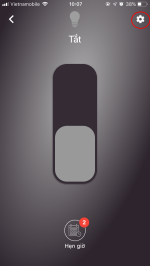
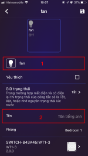

Đặt tên thiết bị bằng tiếng Anh trong mục 1 và mục 2:

* Mục 1: Tên sẽ được dùng khi điều khiển bằng tiếng Anh
* Mục 2: Tên sẽ được dùng khi điều khiển bằng tiếng Việt trong tương lai

### 1.2. Quy chuẩn đặt tên

Về nguyên tắc, để điều khiển các thiết bị Smarthome bằng giọng nói, trước tiền cần định danh (đặt tên) cho thiết bị. Tuy nhiên, khi lắp đặt lượng lớn các thiết bị smarthome cần phải tuân thủ một số nguyên tắc đặt tên nhằm tránh gây khó khăn trong việc điều khiển như:

**Phân theo loại thiết bị, vd:**

* Đèn: Light
* Quạt: Fan
* Rèm: Curtain
* Điều khiển hồng ngoài: Remote
* ...

**Phân biệt theo chức năng của thiết bị, vd:**

* Đèn trần: Ceiling light
* Đèn ban công: Balcony light
* Đèn hành lang: Corridor light
* ...

**Thêm tên phòng để phân biệt các thiết bị cùng chức năng**

Trong một gia đinh có nhiều phòng, sẽ có một số thiết bị có cùng chức năng nhưng ở nhiều phòng khác nhau như: đèn trần phòng ngủ, đèn trần phòng khách,... Trong trường hợp này cần bổ sung thêm tiền tố (có thể dùng tên phòng, chủ phòng,... để đặt tiền tố) để phân biệt, vd:

* Living room light
* Living room curtain
* Bedroom light
* Mom room light
* Parent room light

## 2. Hướng dẫn liên kết Sunshine Smarthome với Google Home

Bước 1: Sao chép mã truy cập trên ứng dụng Sunshine Smarthome

* Mở ứng dụng Sunshine Smarthome, vào mục Tài khoản chọn Mã truy cập
* Sao chép mã truy cập hiển thị trên màn hình 

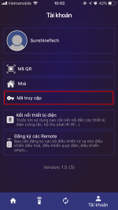
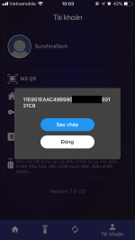

Bước 2: Liên kết với ứng dụng Google Home

* Download ứng dụng Google Home:

    * [IOS](https://apps.apple.com/au/app/google-home/id680819774)
    * [Android](https://play.google.com/store/apps/details?id=com.google.android.apps.chromecast.app&hl=en)

* Mở ứng dụng Google Home, vào mục Thêm và quản lý (dấu + ở màn hình chính) chọn Thiết lập thiết bị.

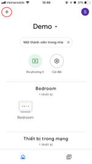
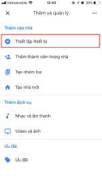

* Trong Thiết lập thiết bị, chọn Bạn đã thiết lập dịch vụ hoặc thiết bị?

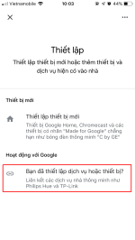

* Tìm và chọn Sunshine Tech

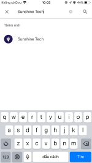

* Dán mã truy cập đã sao chép ở bước trên và chọn đăng nhập

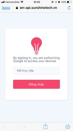
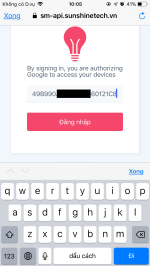

## 3. Hướng dẫn sử dụng

### 3.1. Điều khiển thiết bị bằng ứng dụng Google Home

Sau khi kết nối Sunshine Smarthome với Google Home thành công, giao diện màn hình trên ứng dụng Google Home sẽ hiển thị các thiết bị của bạn

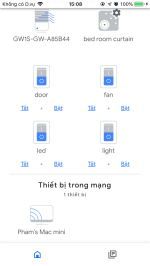

Tại đây, chúng ta có thể điều khiển công tắc và điều khiển điều hòa, riêng công tắc rèm sẽ không thể điều khiển bằng Google Home.

### 3.2. Điều khiển thiết bị bằng giọng nói

Bạn có thể điều khiển thiết bị bằng giọng nói thông qua:

* Google Assistant trên Smartphone
    * [IOS](https://apps.apple.com/us/app/google-assistant/id1220976145)
    * [Android](https://play.google.com/store/apps/details?id=com.google.android.apps.googleassistant&hl=en)

* Các loa thông minh của Google:
    * Google Nest Mini
    * Google Nest Hub
    * Google Nest Hub Max

### 3.3. Đồng bộ thiết bị

Khi có bất kì thay đổi trên ứng dụng Sunshine Smarthome (thêm xóa thiết bị, đổi tên thiết bị,...) để đồng bộ những thay đổi đó lên ứng dụng Google Home chúng ta có thể ra lệnh trên google assistant: `sync my device`

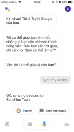

## 4. Mẫu câu lệnh điều khiển thiết bị

### 4.1. Công tắc

**On/Off**

* Ok Google. Turn on `Tên Công Tắc`
* Ok Google. Turn off `Tên Công Tắc`

### 4.2. Điều khiển đa năng (IR Gateway)

**FanSpeed**

* Ok Google. Set the `Tên Điều Khiển` to Auto
* Ok Google. Set the `Tên Điều Khiển` to Low
* Ok Google. Set the `Tên Điều Khiển` to Medium
* Ok Google. Set the `Tên Điều Khiển` to High
* Ok Google. Set the `Tên Điều Khiển` speed to 70 percent

**Modes**

* Ok Google. Change the mode to auto on the `Tên Điều Khiển`
* Ok Google. Change the mode to cool on the `Tên Điều Khiển`
* Ok Google. Change the mode to heat on the `Tên Điều Khiển`
* Ok Google. Change the mode to dry on the `Tên Điều Khiển`
* Ok Google. Change the position to auto on the `Tên Điều Khiển`
* Ok Google. Change the position to low on the `Tên Điều Khiển`
* Ok Google. Change the position to medium on the `Tên Điều Khiển`
* Ok Google. Change the position to high on the `Tên Điều Khiển`

**On/Off**

* Ok Google. Turn on the `Tên Điều Khiển`
* Ok Google. Turn off the `Tên Điều Khiển`

**TemperatureSetting**

* Ok Google. Set the `Tên Điều Khiển` to 20 degrees
* Ok Google. Set the `Tên Điều Khiển` to 30 degrees
* Ok Google. Change the `Tên Điều Khiển` to auto mode
* Ok Google. Change the `Tên Điều Khiển` to cool mode
* Ok Google. Change the `Tên Điều Khiển` to heat mode
* Ok Google. Change the `Tên Điều Khiển` to dry mode

### 4.3. Rèm cửa

**Open/Close**

* Ok Google. Open the `Tên Rèm Cửa`
* Ok Google. Close the `Tên Rèm Cửa`
* Ok Google. Open the `Tên Rèm Cửa` to 70 percent
* Ok Google. Close the `Tên Rèm Cửa` to 20 percent
* Ok Google. Open the `Tên Rèm Cửa` IN to 60 percent
* Ok Google. Open the `Tên Rèm Cửa` OUT to 60 percent
* Ok Google. Close the `Tên Rèm Cửa` IN to 35 percent
* Ok Google. Close the `Tên Rèm Cửa` OUT to 35 percent
