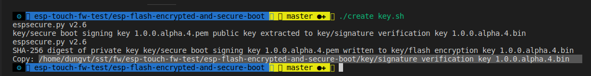
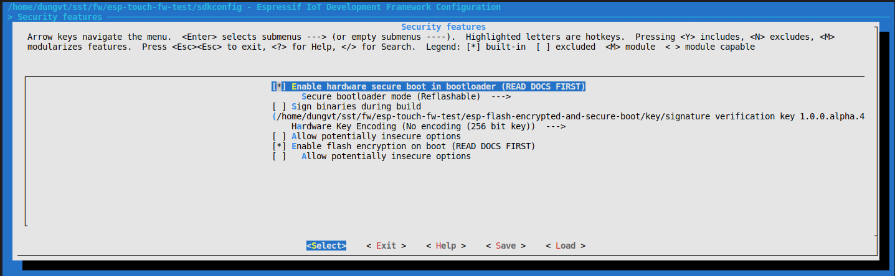

# ESP32 Flash Encrypted And Secure Boot

Tham khảo [Secure Boot](https://docs.espressif.com/projects/esp-idf/en/latest/security/secure-boot.html) [Flash encrypted](https://docs.espressif.com/projects/esp-idf/en/latest/security/flash-encryption.html)

## Giới thiệu

## Thực hiện

### Thiết lập dự án

**Clone dự án**

Để thực hiện flash encrypted và secure boot vào dự án firmware cho esp32. Tiến hành clone vào thư mục dự án

**Copy shell script**

Có 2 shell script thường sử dụng:

- build.sh : Dùng để build firmware có flash encrypted và secure boot
- flash_encrypted.sh : Dùng để flash các file bin được mã hóa

Copy 2 shell script trên vào thư mục dự án để tiện sử dụng

**Copy file secure-bootloader-key-256.bin**

Mặc định khi chạy lệnh build.sh sẽ copy `secure-bootloader-key-256.bin` vào thư mục **build/bootloader**. File `secure-bootloader-key-256.bin` sẽ tự tạo mới nếu không tồn tại, vì vậy cần đảm bảo đã copy nhằm tránh sai xót.

**Cấu trúc dự án sau khi setup**

```
project
└───build
│   └───bootloader
|       └───secure-bootloader-key-256.bin
|
└───esp-flash-encrypted-and-secure-boot
|
└───build.sh
│   
└───flash_encrypted.sh
│   
└───main
|   │───app_main.c
|   │───...
|
└───...
```

### Build and flash

**Tạo key**

- Mở terminal, di chuyển đến thư mục **esp-flash-encrypted-and-secure-boot**

- Chạy lênh `./create_key.sh`

- Copy đường dẫn đến file key



**Cấu hình trong make menuconfig**

- Trong dự án firmware, chạy lệnh `make menuconfig`

- Vào mục **Security Features**, thiết lập các tùy chọn như hình bên dưới.



**Lưu ý** Paster đường dẫn file key copy từ bước tạo key vào mục **Secure boot private signing key**

- Vào mục **Bootloader config**, thiết lập **Bootloader log verbosity** thành **No ouput**

- Lưu lại các thay đổi

**Build firmware**

- Mở file `build.sh`, tại dòng đồng tiên, thay đổi tên file app.bin theo đúng dự án vd: `app_name="esp-touch-app.bin"`, `esp-parking.bin`

- Chạy file build.sh để biên dịch code băng cách gõ lệnh `./build.sh`

- File sau khi build sẽ nằm trong thư mục **esp-flash-encrypted-and-secure-boot/build**

**Flash**

- Để flash firmware, chạy lệnh `./flash_encrypted.sh`